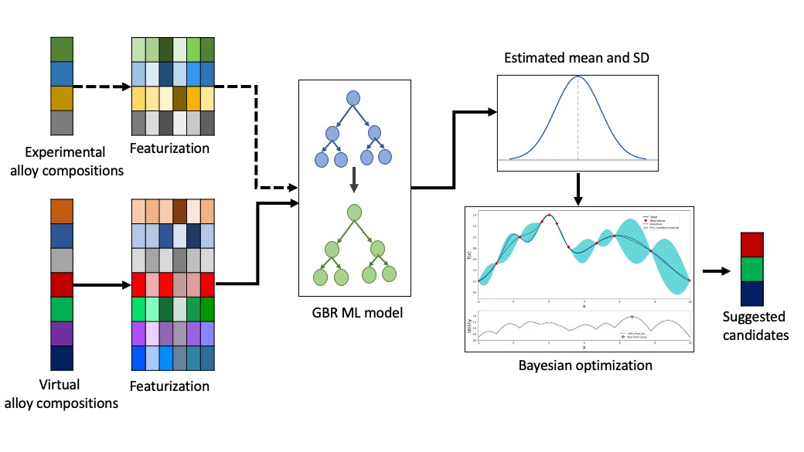

# Nballoy_BO
## Machine learning guided optimal composition selection of niobium alloys for high temperature applications

## Design Strategy
First, we created a high dimensional input feature space for each alloy composition based on the domain knowledge-based material descriptors. Then, a machine learning model was trained to predict the targeted property by learning the alloys’ feature-property relationship. A virtual quaternary and quinary alloy compositions space has been created and using the trained machine learning model with bootstrapping technique we estimated the uncertainties for each candidate in virtual space. Thereafter, the Bayesian optimization algorithm was applied which evaluated a utility function based on the uncertainties of prediction for each candidate to suggest suitable alloy composition. 

## Description of Jupyter Notebooks 

## Candidate search for optimal alloy composition 

1. main_candidate_search_UTS_quaternary.ipynb : Python program file suggest the best quarternay alloy candidates for optimizing UTS  

2. main_candidate_search_YS_quaternary.ipynb : Python program file suggest the best quarternay alloy candidates for optimizing YS 

3. main_candidate_search_addition_quaternay.ipynb : Python program file suggest the best quarternay alloy candidates for optimizing composite target (addition)

4. main_candidate_search_Sqrt_quaternary.ipynb : Python program file suggest the best quarternay alloy candidates for optimizing composite target (Sqrt)

5. EI_Calculation_chunkwise.ipynb : Python program file to calcualte the EI values for large candidate size (quinary alloy having more than 74 million candidates)

## Mechanical properties prediction and peformance comparison between different models with different featurizaton: 

1. UTS_Oliynyk.ipynb : Python program file to compare perfromance in predicting UTS value for differnt ml models GBR, RF, SVR, KNN using Oliynyk feature

2. UTS_SelectedFeatures.ipynb : Python program file to compare perfromance in predicting UTS value for differnt ml models GBR, RF, SVR, KNN using domain knowledge based features

3. UTS_composition.ipynb : Python program file to compare perfromance in predicting UTS value for differnt ml models GBR, RF, SVR, KNN using atom percentage of alloying elements as features

4. YS_Oliynyk.ipynb : Python program file to compare perfromance in predicting YS value for differnt ml models GBR, RF, SVR, KNN using Oliynyk feature

5. YS_SelectedFeatures.ipynb : Python program file to compare perfromance in predicting YS value for differnt ml models GBR, RF, SVR, KNN using domain knowledge based features

6. YS_composition.ipynb : Python program file to compare perfromance in predicting YS value for differnt ml models GBR, RF, SVR, KNN using domain knowledge based features

## Other important python files 

1. Virtual_candidates_alloy_derivation.ipynb : Python program file for creating the virtual alloy candidates depending on different combinations such as quaternay/quinary/senary

2. Nb_strength_data_splitting_F.ipynb : Python program file for splitting the original data into different train/test datasets based on alloy uniqueness so that the alloy present in the training data should not repeat in the test dataset

3. performance_diff_traintest_split.ipynb : Python program file to compare the performance for differnt train/test split of the original alloy dataset

4. UMAP_All.ipynb : Pyhton program file to represent the alloy compostitons (Experimental as well as Suggested) in the two dimensional UMAP representations 

5. MOO_relationship.ipynb : Python program file to represent the relationship between YS, UTS and the composite properties for Multi Objective optimization 

6. MLP_UTS.ipynb : Python program file for performance evaluation of Multi Layer Perceptron for UTS prediction 

7. MLP_YS.ipynb : Python program file for performance evaluation of Multi Layer Perceptron for YS prediction 

8. Dstance_suggested_alloy.ipynb : Eucledian Distance of all suggested alloy candidates from Nb87.7W11.2Zr1.1 (highest performing existing alloy)

9. Nb_Dataset.ipynb : Visualization of Nb alloy existing strength data

## Required Packages
Python 3.9.6  
numpy 1.20.3  
scipy 1.7.0  
pandas 1.3.0  
matplotlib 3.4.2  
seaborn 0.11.1  
scikit-learn 0.24.2  
umap-learn 0.5.2 
tensorflow 2.11.0
